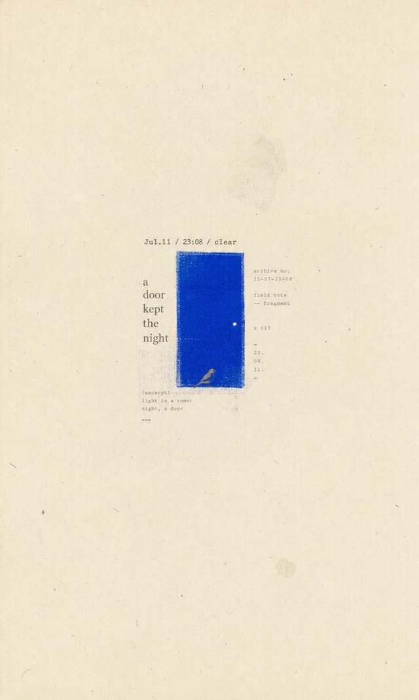
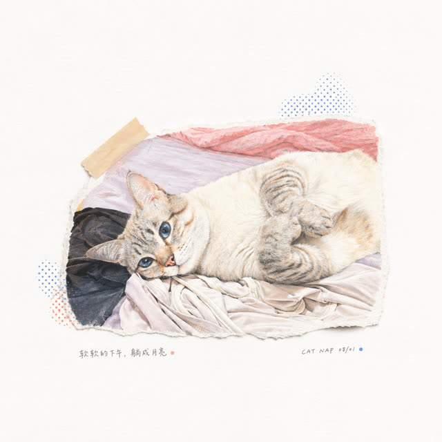
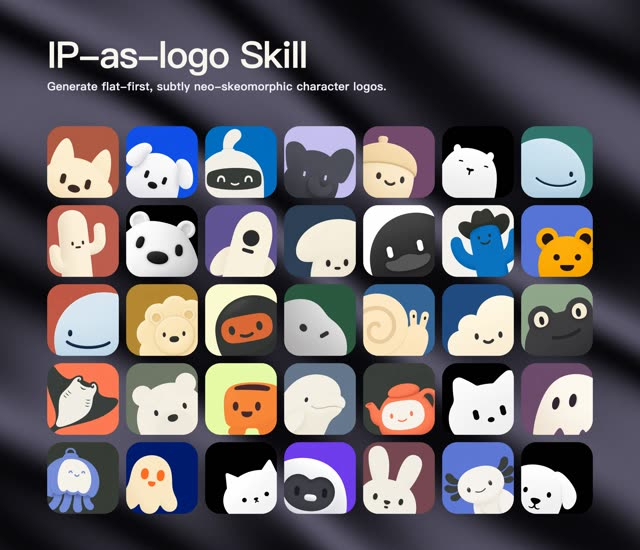

# Awesome Claude Skills ZH   

> 🇨🇳 **中文**：精选 Claude Skills、Agent Skills、LLM Skills 及 AI 智能体开发资源列表。  
> 🇺🇸 **English**: A curated list of awesome Claude Skills, Agent Skills, and AI resources.

---

**维护者 (Maintainer)**: [云中江树 (yzfly)](https://github.com/yzfly)  
**微信公众号**: 云中江树

  <a href="#-设计类-skills-专题-design-skills-showcase">🎨 设计专题</a> •
  <a href="#-背景与核心概念-background--concepts">背景概念</a> •
  <a href="#-agent-skill-开放标准-open-standard">开放标准</a> •
  <a href="#-官方文档-official-documentation">官方文档</a> •
  <a href="#-开源-skills-库-open-source-skills">开源库</a> •
  <a href="#-明星单项-skills-featured-standalone-skills">明星 Skills</a> •
  <a href="#-安全与逆向-security--reverse-engineering">安全逆向</a> •
  <a href="#-女娲--人物思维-skill-生态-nuwa--persona-skills">女娲生态</a> •
  <a href="#-中文社区-skills-chinese-community">中文社区</a> •
  <a href="#-工具与基础设施-tools--infrastructure">工具设施</a> •
  <a href="#-深度文章-articles">深度文章</a>

---

## 📖 目录 (Table of Contents)

- [🎨 设计类 Skills 专题 (Design Skills Showcase)](#-设计类-skills-专题-design-skills-showcase) **NEW**
- [背景与核心概念 (Background & Concepts)](#-背景与核心概念-background--concepts)
  - [什么是 Agent Skills？](#什么是-agent-skills)
  - [核心价值：上下文效率](#核心价值上下文效率-context-efficiency)
  - [架构演进：代码优先](#架构演进代码优先-code-first)
- [Agent Skill 开放标准 (Open Standard)](#-agent-skill-开放标准-open-standard)
- [官方文档 (Official Documentation)](#-官方文档-official-documentation)
- [开源 Skills 库 (Open Source Skills)](#-开源-skills-库-open-source-skills)
- [明星单项 Skills (Featured Standalone Skills)](#-明星单项-skills-featured-standalone-skills)
- [安全与逆向 (Security & Reverse Engineering)](#-安全与逆向-security--reverse-engineering)
- [女娲 · 人物思维 Skill 生态 (Nuwa / Persona Skills)](#-女娲--人物思维-skill-生态-nuwa--persona-skills)
- [中文社区 Skills (Chinese Community)](#-中文社区-skills-chinese-community)
- [工具与基础设施 (Tools & Infrastructure)](#-工具与基础设施-tools--infrastructure)
- [精选资源集合 (Awesome Collections)](#-精选资源集合-awesome-collections)
- [深度文章 (Articles)](#-深度文章-articles)
- [关于作者 (About)](#-关于作者-about)
- [Star History](#star-history)

---

## 🎨 设计类 Skills 专题 (Design Skills Showcase)

> **一句话安装，照片变海报。** 这批 Skill 都是「现成的工作流」：从一句话、一张废片到一张可以直接发的纸刊 / 海报 / IP 形象，中间只差一个 Skill。它们遵循 [Agent Skills 开放标准](#agent-skill-开放标准-open-standard)，原生为 Codex 编写，同样可以放进 Claude Code（`~/.claude/skills/`）、Cursor、豆包、WorkBuddy 等支持 Skill 的 Agent；出图质量取决于宿主可用的图像模型（GPT Image 2 / Nano Banana Pro 等）。
>
> **通用安装**：`npx skills@latest add <owner>/<repo>`，或直接 `git clone` 到技能目录（Codex：`~/.codex/skills/`，Claude Code：`~/.claude/skills/`），重启 Agent 后用 `$skill-name` 调用。

| 视觉配图 | Skill |
| :---: | :--- |
|  | **01 · 极简 zine 海报** [**LiamGvchi/gc-minimal-zine-poster**](https://github.com/LiamGvchi/gc-minimal-zine-poster)  大留白纸刊，把一句话做成情绪海报。默认 3:5 旧纸底、70%–90% 留白、一个小主体 + 一处高饱和色块 + 打字机 / 衬线小字，带 risograph、复印机、网点等印刷瑕疵。支持生成、参考分析、仅出 prompt、照片输入四种模式。 **适合**：公众号封面、App 故事头图、读书日记一页。 **调用**：`$gc-minimal-zine-poster-v0-3`，装到 `~/.codex/skills/gc-minimal-zine-poster-v0-3` |
|  | **02 · 废片焕新 Photo Revival** [**dacnay816y62-hub/photo-revival**](https://github.com/dacnay816y62-hub/photo-revival)  普通照片重画成白纸上的手绘诗：3:4 竖构图、80%–88% 留白，主体插画只占整页 10%–16%，铅笔 / 水彩 / 干刷笔触加一句很小的中文批注。先识别照片里 1–3 个记忆点再重绘，不是滤镜。 **适合**：日常碎片 → 温柔小画，猫 / 食物 / 旧店随手拍都能用。 **调用**：`$photo-revival` |
|  | **03 · 点阵印刷海报** [**v92388375-gif/pixel-style-poster-skill**](https://github.com/v92388375-gif/pixel-style-poster-skill)  精细点阵 bitmap 印刷风，**不是复古游戏像素**：大面积细网点主体、主体贴字排版、周围小注释、克制的配色系统与低分辨率印刷质感，可选彩色水洗反网点变体。 **适合**：植物 / 自然主题配图、小众审美产品图。 **调用**：`$pixel-style-poster-skill` |
|  | **04 · 拾景纸刊 Gathered Scenes Zine** [**Zeejay0/gathered-scenes-zine-skill**](https://github.com/Zeejay0/gathered-scenes-zine-skill)  一个仓库两条路：**实景拼贴**（`$scenes-gathered-zine-v1-3`，真实照片作锚点 + 抽象色块 + 手撕纸边）和**影像蒸馏**（`$scene-distillation-zine-v1-3`，从照片提炼情绪，重做一张不含原照片的独立纸刊）。每个案例按「原始照片 → 观察记录 → 最终作品」归档。 **适合**：旅行照 → 品牌纸刊、用户投稿再创作。 **注意**：非商用许可。 |
|  | **05 · 纸上留影 Photo Relic Editorial** [**wnby/photo-relic-editorial**](https://github.com/wnby/photo-relic-editorial)  竖版编辑图：上半保留真实照片，下半生成克制、可识别、带纸张质感的版画「记忆标本」，从原图提取结构、光线、颜色与重心。自带「纸上北京」系列（天坛、鸟巢、角楼、中国尊……）与四字中文标题范式。 **适合**：城市地标 / 旅行建筑摄影的编辑化包装。 **调用**：`$photo-relic-editorial` |
|  | **06 · 摄影抽象编辑 Photo Abstract Editorial** [**ZzzLc0405/photo-abstract-editorial**](https://github.com/ZzzLc0405/photo-abstract-editorial)  摄影区 + 抽象记忆面板 + 一句诗意英文标题，高级感拉满。照片是唯一内容来源，面板里每个色块、弧线、短条都能追溯到原图中真实的空间与色彩关系。附中英双语完整 prompt，可脱离 Skill 直接当提示词用。 **适合**：小红书高级感封面、日常随手拍 → 艺术海报。 **注意**：CC BY-NC-SA 4.0，非商用。 |
|  | **07 · IP as Logo 极简圆润 IP 形象生成器** [**s1dashu/ip-as-logo-skill**](https://github.com/s1dashu/ip-as-logo-skill)  装进 Agent 的品牌形象设计技能。一句「给我的产品设计一个简单的鬼魂 IP 角色，深海军蓝实色背景」丢给 Codex / 豆包 / WorkBuddy，它先给出三个设计方向，确认后一次产出六个独立候选（三个左下、三个右下出场），每个都是 4–7 个基础形状拼成的圆润轮廓、三色（两色 IP + 一色实底）、可直接商用的方形成品。配套免费素材站 [ipaslogo.com](https://ipaslogo.com)。 **适合**：产品 / App / 公众号吉祥物、品牌 IP 起稿。 **安装**：`npx skills@latest add s1dashu/ip-as-logo-skill` |

配图均取自各仓库 README 示例并缩放，版权归原作者所有；如需高清原图与更多案例请进入对应仓库。

---

## 💡 背景与核心概念 (Background & Concepts)

本章节旨在深入解析 Claude Skills 的技术原理与应用场景，帮助开发者理解为何需要 Skills 以及如何正确构建它。

### 什么是 Agent Skills？

**Agent Skills（智能体技能）** 本质上是关于“**如何做（How-to）**”的知识编码。它不仅仅是提示词，更是智能体的行动指南。

*   **模块化与文件化 (Modularization & Documentation)**  
    在传统的 Prompt Engineering 中，我们往往将大量的指令、示例和约束条件塞入 System Prompt，导致上下文窗口（Context Window）迅速膨胀且难以维护。Anthropic 提出的 Skills 概念，旨在将这些程序性知识**模块化**、**文件化**。

*   **结构化定义 (Structured Definition)**  
    根据 `anthropics/skills` 官方规范，一个 Skill 不仅仅是一段提示词，它是一个包含结构化元数据（YAML Frontmatter）和详细指令（Markdown）的独立单元。
    > **示例**：一个“企业文档编写”的 Skill，不仅包含“语气正式、格式规范”的要求，还可能通过 `SKILL.md` 文件定义了如何调用 Python 脚本来处理 PDF 数据，或者如何验证 Excel 报表的准确性。

### 核心价值：上下文效率 (Context Efficiency)

Skills 的核心价值在于极大地提升了**上下文效率**。与 MCP (Model Context Protocol) 服务器预加载大量工具定义不同，Skills 往往采用“按需加载”或“渐进式披露”的策略。

*   **工作机制**：智能体可能首先读取一个高层级的 Skill 索引，仅在确认为“数据清洗任务”时，才动态加载具体的数据处理 Skill。
*   **类脑机制**：这种机制类似于人类专家在面对特定任务时调取特定的专业记忆，而非时刻保持所有知识在工作记忆中激活。这既节省了 Token，又减少了模型因信息过载产生的幻觉。

### 架构演进：代码优先 (Code-First)

在架构演进中，一个值得注意的趋势是**“代码优先（Code-First）”对纯文本工具调用的替代**。

*   **传统痛点**：传统的 MCP 工具调用（Tool Calling）往往涉及繁琐的 JSON 结构生成。这不仅消耗大量 Token，而且在处理复杂嵌套结构时容易出错。
*   **新范式**：Anthropic 的研究表明，通过让 Agent 编写并执行代码（如 Python 或 Bash 脚本）来调用 MCP 工具，可以显著降低 Token 消耗并提高任务成功率。
    > **示例**：与其让模型生成五个独立的 `read_file` 工具调用 JSON 来读取五个文件，不如让它编写一个 Python `for` 循环来批量读取。
*   **沙盒执行**：这种 **Sandboxed Code Execution（沙盒代码执行）** 模式，结合 MCP 的标准化接口，正在成为构建复杂 Agent 的主流范式。

---

## Agent Skill 开放标准 (Open Standard)

> **最新动态 (2025.12.18 Update)**: Claude 正式开放 Skill 标准，旨在统一智能体技能的描述与交互方式。

> **重要背景**: Agent Skills 开放标准已捐赠给 Linux Foundation 旗下的 **Agentic AI Foundation (AAIF)**，由中立的开放治理机构推动其演进，确保标准不被单一厂商绑定。

*   **AAIF 基金会**:  
    🌐 [https://aaif.io](https://aaif.io)

*   **官方标准网站**:  
    🌐 [https://agentskills.io](https://agentskills.io)

*   **GitHub 标准仓库**:  
    📂 [https://github.com/agentskills/agentskills](https://github.com/agentskills/agentskills)

#### ⚡️ 快速开发辅助
本仓库提供了 Skills 的标准描述文件，您可以直接复制以下文件内容提供给 AI，方便与 AI 协同开发符合标准的 Skills：
*   📄 **[agentskills.txt](./agentskills.txt)** (点击查看或下载)

---

## 📘 官方文档 (Official Documentation)

Anthropic 官方发布的关于 Agent Skills 的核心指南，是理解技术细节的权威来源。

> **📕 重磅推荐 — Claude 技能构建完全指南 (The Complete Guide to Building Skills for Claude)**
>
> Anthropic 官方出品，从基础概念、规划与设计、测试与迭代、分发与共享到模式与故障排除，系统性地讲解如何构建高质量的 Claude Skill。**强烈建议通读。**
>
> **[英文原版 PDF](./docs/The%20Complete%20Guide%20to%20Building%20Skills%20for%20Claude.pdf)** | **[中文版 PDF](./docs/The-Complete-Guide-to-Building-Skill-for-Claude.no_watermark.zh-CN.pdf)**

| 资源名称 | 描述 |
| :--- | :--- |
| **[用 Agent Skills 为 Agent 赋能](https://www.anthropic.com/engineering/equipping-agents-for-the-real-world-with-agent-skills)** | 📜 **Blog** - 官方博客，深入浅出地介绍了如何利用 Skills 应对真实世界的复杂任务。 |
| **[Agent Skills 开发者指南](https://platform.claude.com/docs/en/build-with-claude/skills-guide)** | 📘 **Guide** - 构建 Skills 的详细技术指南，包含从零开始的步骤。 |
| **[Agent Skills 编写最佳实践](https://platform.claude.com/docs/en/agents-and-tools/agent-skills/best-practices)** | 🌟 **Best Practices** - 提高 Skills 质量、鲁棒性和可复用性的官方建议。 |
| **[Agent Skills 参考文档](https://platform.claude.com/docs/en/agents-and-tools/agent-skills/overview)** | ⚙️ **API Reference** - 包含详细的技术参数、YAML 格式规范与 API 参考。 |
| **[使用 Claude Agent SDK 构建智能体](https://www.anthropic.com/engineering/building-agents-with-the-claude-agent-sdk)** | 🛠️ **SDK Tutorial** - 结合官方 SDK 进行开发的实战教程。 |

---

## 📦 开源 Skills 库 (Open Source Skills)

可以直接使用、参考或集成到项目中的 Skill 集合与代码库。

#### 🌟 官方推荐
| 项目 | ⭐ Stars | 简介 |
| :--- | ---: | :--- |
| [**anthropics/claude-plugins-official**](https://github.com/anthropics/claude-plugins-official) |  | Anthropic 官方运营的高质量 Claude Code 插件目录，集中发现与安装官方精选插件（含 Skills 打包分发）。 |
| [**anthropics/skills**](https://github.com/anthropics/skills) |  | Anthropic 官方维护的 Agent Skills 公共仓库，理解标准实现的最佳参考，含多个通用 Skill 范例。 |
| [**anthropics/claude-cookbooks**](https://github.com/anthropics/claude-cookbooks/tree/main/skills) |  | 官方 Cookbook 的 Skills 目录，提供可直接运行的端到端示例与教程，适合上手实践。 |

#### 🚀 社区框架
| 项目 | ⭐ Stars | 简介 |
| :--- | ---: | :--- |
| [**obra/superpowers**](https://github.com/obra/superpowers) |  | 2026 年最具影响力的社区 Skills 框架，已入选官方插件市场，提供一整套可组合的高级 Skill 与工作流。 |
| [**obra/superpowers-marketplace**](https://github.com/obra/superpowers-marketplace) |  | Superpowers 配套的 Skills 市场，便于发现、安装与分享社区贡献的 Skills。 |

#### 📚 大型 Skills 合集
| 项目 | ⭐ Stars | 简介 |
| :--- | ---: | :--- |
| [**phuryn/pm-skills**](https://github.com/phuryn/pm-skills) |  | 产品经理 Skills 市场：100+ 覆盖从需求发现、战略、执行到发布与增长的 Agent 技能、命令与插件。 |
| [**KKKKhazix/khazix-skills**](https://github.com/KKKKhazix/khazix-skills) |  | 「数字生命卡兹克」开源的中文 Skills 合集：leader（帮你定义目标）、neat-freak 洁癖、hv-analysis、khazix-writer 等，兼容 Claude Code / Codex。 |
| [**antfu/skills**](https://github.com/antfu/skills) |  | Anthony Fu 精选的 Agent Skills 合集，偏前端 / 开源工程实践。 |
| [**MengTo/Skills**](https://github.com/MengTo/Skills) |  | Design+Code 作者 Meng To 面向设计师与 builder 的 Skills，适配 Codex / Claude / Cursor。 |
| [**BuilderIO/skills**](https://github.com/BuilderIO/skills) |  | Builder.io 出品的小而可组合的编码 Agent 技能集，一条命令安装推荐技能。 |
| [**jakubkrehel/skills**](https://github.com/jakubkrehel/skills) |  | 界面设计技能集：UI、排版、色彩、无障碍、布局与产品文案，`better-interface` 一键做整体评审。 |
| [**larksuite/cli**](https://github.com/larksuite/cli) |  | 飞书 / Lark 官方 CLI，为人和 Agent 而建，覆盖文档、多维表格、消息、日历等核心业务对象，可作为 Skill 直接调用。 |
| [**mattpocock/skills**](https://github.com/mattpocock/skills) |  | TypeScript 知名教育者 Matt Pocock 个人 `.claude` 目录中的工程实战 Skills，小而易改、可组合、与模型无关，覆盖 `/tdd`、`/grill-me`、架构改进、领域建模、调试等软件工程基本功。 |
| [**addyosmani/agent-skills**](https://github.com/addyosmani/agent-skills) |  | Addy Osmani 出品的「生产级」工程 Skills 合集，面向 AI 编程智能体，覆盖前端、性能、调试等高质量工程实践。 |
| [**vercel-labs/agent-skills**](https://github.com/vercel-labs/agent-skills) |  | Vercel 官方出品的 Agent Skills 合集，面向 Next.js、Vercel 平台与现代前端工程实践。 |
| [**alirezarezvani/claude-skills**](https://github.com/alirezarezvani/claude-skills) |  | 社区最大规模合集之一，收录 **337** 个 skills / agent skills / 插件，含 30+ Agents、70+ 自定义命令。 |
| [**muratcankoylan/Agent-Skills-for-Context-Engineering**](https://github.com/muratcankoylan/Agent-Skills-for-Context-Engineering) |  | 面向上下文工程（Context Engineering）与多智能体架构的 Agent Skills 合集，聚焦上下文管理与协作编排实践。 |
| [**Jeffallan/claude-skills**](https://github.com/Jeffallan/claude-skills) |  | 面向全栈开发者的 **66** 个专精 Skills，将 Claude Code 打造成全栈开发搭档。 |
| [**mrgoonie/claudekit-skills**](https://github.com/mrgoonie/claudekit-skills) |  | ClaudeKit.cc 出品的全套高质量 Skills 合集。 |
| [**simonw/claude-skills**](https://github.com/simonw/claude-skills) |  | Simon Willison 整理的 `/mnt/skills` 目录真实内容，适合研究官方内置 Skill 的实现。 |
| [**mohitagw15856/pm-claude-skills**](https://github.com/mohitagw15856/pm-claude-skills) |  | 覆盖 17 个职业方向的 **167** 个专业级 Skills，主打产品 / 项目管理与办公效率。 |
| [**coleam00/second-brain-skills**](https://github.com/coleam00/second-brain-skills) |  | 将 Claude Code 变成「第二大脑」的合集，主打知识管理与个人信息检索。 |
| [**jezweb/claude-skills**](https://github.com/jezweb/claude-skills) |  | 面向 Claude Code CLI 的全栈开发 Skills，涵盖 Cloudflare、React、Tailwind v4。 |
| [**JasonColapietro/suede-creator-skills**](https://github.com/JasonColapietro/suede-creator-skills) |  | 面向 Claude Code 与 Codex 的 **67 个 MIT 开源 Skills**，覆盖多智能体编排、Codex 工作节点集群、代码审查与发布门禁、AI 评测、产品、设计和增长工作流。 |

#### 🔬 垂直领域
| 项目 | ⭐ Stars | 简介 |
| :--- | ---: | :--- |
| [**tt-a1i/archify**](https://github.com/tt-a1i/archify) |  | 生成可验证的架构图 / 流程图 / 时序图 / 数据流图的 Skill，自包含 HTML 输出。 |
| [**earthtojake/text-to-cad**](https://github.com/earthtojake/text-to-cad) |  | CAD / CAE / CAM 领域的 Agent Skills 库。 |
| [**nicobailon/visual-explainer**](https://github.com/nicobailon/visual-explainer) |  | 把图表、diff 评审、计划审计、数据表等渲染成精美 HTML 页面或幻灯片的 Skill。 |
| [**kangarooking/cangjie-skill**](https://github.com/kangarooking/cangjie-skill) |  | 「仓颉」：把书、长视频、播客等高价值内容蒸馏成可执行 Agent Skill 的中文项目。 |
| [**chuspeeism/dashi-ppt-skill**](https://github.com/chuspeeism/dashi-ppt-skill) |  | 多视觉主题的浏览器可编辑演示文稿生成 Skill，可导出 HTML / PDF / PPTX。 |
| [**isjiamu/gzh-design-skill**](https://github.com/isjiamu/gzh-design-skill) |  | 把 Markdown 一键排成可直接粘进微信公众号编辑器的精致 HTML，6 套主题 + 主题生成器。 |
| [**Vincentwei1021/video-shotcraft**](https://github.com/Vincentwei1021/video-shotcraft) |  | 面向 Claude Code / Codex 的 AI 视频 Skill：用 Remotion 做电影感产品视频，含 152 张分镜配方卡。 |
| [**petergyang/no-ai-slop**](https://github.com/petergyang/no-ai-slop) |  | 去除写作中 20+ 种「AI 味」套路而不抹平个人语气。 |
| [**firecrawl/anydoc**](https://github.com/firecrawl/anydoc) |  | Firecrawl 的 Rust 文档转 Markdown 库以 Skill 形式分发，让 Agent 读懂 Word / PPT / Excel / PDF / EPUB。 |
| [**microsoft/skill-recorder**](https://github.com/microsoft/skill-recorder) |  | 微软开源桌面应用：录一遍屏幕操作，用 Copilot CLI 自动生成可复用的 Skill。 |
| [**yzfly/awesome-dsh-skills**](https://github.com/yzfly/awesome-dsh-skills) |  | DeepSeek Harness（dsh）技能 / 插件中文精选，自动收录并验证。 |
| [**K-Dense-AI/scientific-agent-skills**](https://github.com/K-Dense-AI/scientific-agent-skills) |  | **125+** 个科学研究类 Skills，专为科研设计，涵盖文献分析、数据处理等领域。 |
| [**calesthio/OpenMontage**](https://github.com/calesthio/OpenMontage) |  | 开源的 agentic 视频生产系统，内置 **500+** Agent Skills，覆盖剪辑、转场、字幕、调色等全流程视频创作。 |
| [**nowork-studio/NotFair**](https://github.com/nowork-studio/NotFair) |  | 开源营销增长 Skills，覆盖 SEO、GEO、Google Ads、Meta Ads 等投放场景。 |
| [**dominikmartn/nothing-design-skill**](https://github.com/dominikmartn/nothing-design-skill) |  | 以 Nothing 设计语言（单色、点阵风）生成 UI 的 Skill。 |
| [**samber/cc-skills-golang**](https://github.com/samber/cc-skills-golang) |  | 一套实际可用的 Golang agentic skills 合集，面向 Go 工程实践。 |
| [**aaron-he-zhu/seo-geo-claude-skills**](https://github.com/aaron-he-zhu/seo-geo-claude-skills) |  | 20 个 SEO 与 GEO（生成式引擎优化）Skills，兼容 35+ AI 智能体。 |
| [**tradermonty/claude-trading-skills**](https://github.com/tradermonty/claude-trading-skills) |  | 面向股票投资者与交易员的 Skills，提供市场分析、技术指标等能力。 |
| [**jherrodthomas/automotive-skills-suite**](https://github.com/jherrodthomas/automotive-skills-suite) |  | **100+** 个汽车工程领域 Skills，覆盖 ISO 26262 功能安全等专业场景。 |
| [**Sushegaad/Claude-Skills-Governance-Risk-and-Compliance**](https://github.com/Sushegaad/Claude-Skills-Governance-Risk-and-Compliance) |  | 治理、风险与合规（GRC）专家级 Skills，覆盖 ISO 27001、SOC 2、GDPR、HIPAA、NIST、EU AI Act 等数十种标准。 |
| [**jherrodthomas/robotics-skills-suite**](https://github.com/jherrodthomas/robotics-skills-suite) |  | **76** 个可审计的机器人领域 Skills，覆盖工业机器人、协作机器人、AMR、ROS2 与 IEC 62443 全生命周期。 |
| [**posit-dev/skills**](https://github.com/posit-dev/skills) |  | Posit（原 RStudio）官方出品的 Claude Skills 合集，面向 R 与数据科学。 |
| [**palkan/skills**](https://github.com/palkan/skills) |  | 基于《Layered Rails》一书提炼的 Rails 开发 Skills，作者为 Evil Martians 的 palkan。 |
| [**jamditis/claude-skills-journalism**](https://github.com/jamditis/claude-skills-journalism) |  | 面向新闻、媒体与学术的 Skills：事实核查、FOIA 信息公开、数据新闻、学术写作等。 |
| [**Pluviobyte/video-production-skills**](https://github.com/Pluviobyte/video-production-skills) |  | 可复用的 AI 视频制作技能库，覆盖创作、复刻、运动设计、片头与 QA 全流程。 |
| [**iart-ai/motion-skills**](https://github.com/iart-ai/motion-skills) |  | 50 个开源 skill，教 AI 编码智能体制作动态图形、动画与视频——动态排版、数据可视化、讲解动画、短视频、WebGL、Manim，打包成 14 个可安装包（由动态智能体 iart.ai 出品）。 |
| [**haowjy/creative-writing-skills**](https://github.com/haowjy/creative-writing-skills) |  | 专注创意写作的 Claude skills 合集。 |
| [**ahmedasmar/devops-claude-skills**](https://github.com/ahmedasmar/devops-claude-skills) |  | 面向 DevOps 工作流的 Claude Code Skills 市场。 |
| [**gamedev-skills/awesome-gamedev-agent-skills**](https://github.com/gamedev-skills/awesome-gamedev-agent-skills) |  | **66** 个游戏开发 Agent Skills + 主路由（自动按引擎/任务加载对应技能），版本锁定、可移植的 SKILL.md 格式，跨 Claude Code/Cursor/Codex/Copilot/Gemini CLI，覆盖 Godot、Unity、Unreal 与 Web。 |
| [**NVIDIA-BioNeMo/bionemo-agent-toolkit**](https://github.com/NVIDIA-BioNeMo/bionemo-agent-toolkit) |  | NVIDIA 官方出品，用 BioNeMo skills 把任意智能体变成生命科学专家。 |
| [**shreyashankar/error-discovery-skill**](https://github.com/shreyashankar/error-discovery-skill) |  | 面向 AI 智能体的交互式错误分析 Skill：研究 LLM trace 数据集、构建审查 UI、监控标注、归类失败模式并提出新样本。 |
| [**yzfly/awesome-design-html**](https://github.com/yzfly/awesome-design-html) |  | **115** 个品牌主题 HTML 设计（93 网页 + 22 iOS，含 20 个中国品牌）打包成的 Claude Code skill，一行安装后直接对话「做一个飞书风的页面」（本仓库维护者 [@yzfly](https://github.com/yzfly) 出品）。 |
| [**saidsurucu/trdizin-skill**](https://github.com/saidsurucu/trdizin-skill) |  | 检索土耳其学术库 TR Dizin（trdizin.gov.tr）的 Agent Skill：通过开放 JSON API 查论文/期刊/作者/机构，支持高级字段检索、引文与 PDF 转文本，无需浏览器、登录或 API key。 |

#### 🛠️ 生态集成
| 项目 | ⭐ Stars | 简介 |
| :--- | ---: | :--- |
| [**googleworkspace/cli**](https://github.com/googleworkspace/cli) |  | Google Workspace 官方 CLI（`gws`），统一访问 Drive/Gmail/Calendar/Sheets/Docs/Chat 等 API；内置 **100+ Agent Skills（`SKILL.md`）**，覆盖每个 API 及常用工作流与 50 个精选配方，让 LLM 无需自定义工具即可操作 Workspace。 |
| [**kepano/obsidian-skills**](https://github.com/kepano/obsidian-skills) |  | Obsidian 作者 [@kepano](https://github.com/kepano) 出品，让智能体通过 Obsidian CLI 与开放文件格式操作笔记库的 Skills 合集。 |
| [**SynaLinks/synalinks-skills**](https://github.com/SynaLinks/synalinks-skills) |  | 专为 **Synalinks** 生态系统设计的 Claude Skills 集合，展示特定框架下的应用。 |
| [**google/skills**](https://github.com/google/skills) |  | Google 官方出品的 Agent Skills 库，覆盖 Google 产品与技术栈（遵循 SKILL.md 开放标准，兼容 Claude Code / Codex / Gemini CLI / Cursor）。 |
| [**huggingface/skills**](https://github.com/huggingface/skills) |  | Hugging Face 官方 Skills，把 HF 生态（模型、数据集、Spaces、推理）能力直接赋予智能体。 |
| [**microsoft/skills**](https://github.com/microsoft/skills) |  | 微软官方出品，为各 SDK 提供 Skills、MCP server、Custom Agents 与 Agents.md，用于「接地」编码智能体。 |
| [**expo/skills**](https://github.com/expo/skills) |  | Expo 官方 Skills 合集，面向 Expo / React Native 项目与 Expo Application Services 开发。 |
| [**cloudflare/skills**](https://github.com/cloudflare/skills) |  | Cloudflare 官方出品，教智能体在 Cloudflare 平台（Workers/KV/R2/D1 等）上构建应用的 Skills。 |
| [**getsentry/skills**](https://github.com/getsentry/skills) |  | Sentry 团队日常开发所用的官方 Agent Skills 合集。 |
| [**google-labs-code/stitch-skills**](https://github.com/google-labs-code/stitch-skills) |  | Google Labs 官方出品，配合 Stitch MCP server 使用的 Agent Skills 库，遵循 Agent Skills 开放标准，兼容 Antigravity / Gemini CLI / Claude Code / Cursor 等编码智能体。 |

---

## ⭐ 明星单项 Skills (Featured Standalone Skills)

GitHub 上 Star 数最高、最具话题度的单一用途 Skill。它们大多只做一件事，却把这件事做到极致，是学习「一个好 Skill 该长什么样」的绝佳范例。

| 项目 | ⭐ Stars | 简介 |
| :--- | ---: | :--- |
| [**multica-ai/andrej-karpathy-skills**](https://github.com/multica-ai/andrej-karpathy-skills) |  | **Star 数最高的单项 Skill（单个 `CLAUDE.md` 文件）**，由华人开发者 **Forrest Chang** 维护，提炼 Andrej Karpathy 的编程理念以改善 Claude Code 行为。中文版见 [LearnPrompt/andrej-karpathy-skills](https://github.com/LearnPrompt/andrej-karpathy-skills)。 |
| [**JuliusBrussee/caveman**](https://github.com/JuliusBrussee/caveman) |  | *"why use many token when few token do trick"*——通过精简表达大幅削减 token 消耗。 |
| [**mvanhorn/last30days-skill**](https://github.com/mvanhorn/last30days-skill) |  | 跨 Reddit / X / YouTube / Hacker News 等平台检索近 30 天动态，汇总成一份综合摘要。 |
| [**OthmanAdi/planning-with-files**](https://github.com/OthmanAdi/planning-with-files) |  | Manus 风格「持久化 Markdown 规划」，让 Claude 把任务计划落盘成文件，长任务不丢上下文。 |
| [**TerminallyLazy/Tree-Ring-Memory**](https://github.com/TerminallyLazy/Tree-Ring-Memory/tree/main/skills/tree-ring-memory) |  | 本地优先的 Agent 记忆生命周期 Skill；指导持久回忆、遗忘、审计、证据记录与 Rust CLI 使用。 |
| [**blader/humanizer**](https://github.com/blader/humanizer) |  | 去除文本中「AI 味」痕迹，让 Claude 生成的文字更自然、更像人写的。 |
| [**Aboudjem/humanizer-skill**](https://github.com/Aboudjem/humanizer-skill) |  | 专治「英文」写作里的 AI 味：53 个模式、5 种语气、0-100 AI 痕迹评分，detect/rewrite/edit 三种模式，另附零依赖度量 CLI 与 CI 质量门。为写英文 README / 文档 / 论文的中文开发者设计，与 op7418/Humanizer-zh（中文向）互补。 |
| [**op7418/guizang-ppt-skill**](https://github.com/op7418/guizang-ppt-skill) |  | 归藏（op7418）出品，生成精美 HTML 幻灯片的 Agent Skill：内置杂志风与瑞士风排版、配图提示词、社交封面，以及 WebGL / 低功耗演示运行时。 |
| [**nidhinjs/prompt-master**](https://github.com/nidhinjs/prompt-master) |  | 为任意 AI 工具自动撰写精准提示词，零 token 调用外部 API。 |
| [**SawyerHood/dev-browser**](https://github.com/SawyerHood/dev-browser) |  | 赋予智能体使用网页浏览器的能力，让 Claude 真正「上网」操作。 |
| [**uditgoenka/autoresearch**](https://github.com/uditgoenka/autoresearch) |  | 受 Karpathy autoresearch 启发的 Claude 自主研究 Skill：以「修改 → 验证 → 保留 / 丢弃 → 循环」的目标驱动迭代，让 Claude Code 自动收敛到目标。 |
| [**zarazhangrui/codebase-to-course**](https://github.com/zarazhangrui/codebase-to-course) |  | 将任意代码库转化为精美、可交互的教程，适合技术布道与上手文档。 |
| [**virgiliojr94/book-to-skill**](https://github.com/virgiliojr94/book-to-skill) |  | 把任意技术书籍 PDF 转化为可学习、可引用的 Claude Code skill。 |
| [**lackeyjb/playwright-skill**](https://github.com/lackeyjb/playwright-skill) |  | 基于 Playwright 的浏览器自动化 Skill，模型可按需自动调用完成网页操作。 |
| [**plannotator/effective-html**](https://github.com/plannotator/effective-html) |  | 用于生成优雅简洁的 HTML 计划、架构图等的 Agent Skill。 |
| [**dgreenheck/webgpu-claude-skill**](https://github.com/dgreenheck/webgpu-claude-skill) |  | 用于 Three.js + WebGPU 应用开发的 Skill。 |
| [**majidmanzarpour/threejs-game-skills**](https://github.com/majidmanzarpour/threejs-game-skills) |  | 构建可玩、精致的 Three.js 浏览器游戏的 Agent skills，覆盖玩法、画质、UI、QA 及可选的 AI 生成 3D/图像/音频资产。 |
| [**tryproduck/produck-skills**](https://github.com/tryproduck/produck-skills) |  | 帮你打造用户喜爱产品的 Agent skills，沉淀产品方法论。 |
| [**zarazhangrui/youtube-to-ebook**](https://github.com/zarazhangrui/youtube-to-ebook) |  | 把喜欢频道的 YouTube 字幕定期转成 EPUB 电子书并投递到邮箱。 |
| [**mrtooher/fable-mode**](https://github.com/mrtooher/fable-mode) |  | 激活 Fable 式 agentic 行为的 Claude Skill：显式多阶段规划、子 agent 委派与自我验证。 |
| [**Gabberflast/academic-pptx-skill**](https://github.com/Gabberflast/academic-pptx-skill) |  | 生成学术演示文稿（会议演讲、研讨、答辩、基金汇报），强制行动式标题、论证结构与引用规范。 |
| [**aiwithremy/claude-skills-llm-council**](https://github.com/aiwithremy/claude-skills-llm-council) |  | 「LLM 议会」：让你的决策经过 5 位 AI 顾问的同行评审后再给出结论。 |
| [**alonw0/web-asset-generator**](https://github.com/alonw0/web-asset-generator) |  | 从 logo、文字或 emoji 生成 favicon、App 图标与社交媒体配图，支持框架自动集成。 |
| [**coffeefuelbump/csv-data-summarizer-claude-skill**](https://github.com/coffeefuelbump/csv-data-summarizer-claude-skill) |  | 上传 CSV 自动用 pandas 生成统计摘要、检测缺失值并产出可视化。 |
| [**ItsssssJack/power-design**](https://github.com/ItsssssJack/power-design) |  | 让幻灯片「不像 AI 做的」：品牌 DNA × 20 条设计原则的演示设计 Skill。 |
| [**zippoxer/subtask**](https://github.com/zippoxer/subtask) |  | 在独立 Git worktree 中调度子智能体并行完成任务的 Skill。 |
| [**keli-wen/agentic-harness-patterns-skill**](https://github.com/keli-wen/agentic-harness-patterns-skill) |  | harness 工程 Agent Skill：记忆、权限、上下文工程与多 agent 协调，从 Claude Code 提炼，中英双语。 |
| [**cclank/lanshu-animated-architecture-diagram**](https://github.com/cclank/lanshu-animated-architecture-diagram) |  | 「岚叔」生成高质量手绘风格动态架构图的 Codex skill：由 JSON spec 一键产出可编辑 Excalidraw、静态 PNG 与真正动起来的 GIF，专为文章讲解、系统架构与流程图设计（黑底手绘技术风）。 |
| [**Johell1NS/browser-search**](https://github.com/Johell1NS/browser-search) |  | 面向 AI 智能体的搜索浏览 Skill：用 SearXNG 联网搜索、Camofox 浏览、CloakBrowser 绕过防护，设计上抗幻觉，自托管、免费、不限量。 |
| [**chrisvoncsefalvay/claude-d3js-skill**](https://github.com/chrisvoncsefalvay/claude-d3js-skill) |  | 专注 d3.js 数据可视化开发的 Skill。 |
| [**blader/theorist**](https://github.com/blader/theorist) |  | 由 humanizer 作者出品，为每个仓库维护一份「运行理论（operating theory）」文档的 Codex/Claude skill。 |
| [**csthink/dashmotion**](https://github.com/csthink/dashmotion) |  | 由纯英文或 Mermaid 生成动画技术图的 Claude skill，输出自包含 HTML/SVG。 |
| [**scottstts/Threejs-Awesome-Graphics-Agent-Skills**](https://github.com/scottstts/Threejs-Awesome-Graphics-Agent-Skills) |  | 为场景与游戏生成出色图形的 three.js agent skill，专注画面表现力。 |
| [**alpacahq/alpaca-skills**](https://github.com/alpacahq/alpaca-skills) |  | Alpaca 官方出品的交易 API 与券商 API agent skill，提供即插即用的 `SKILL.md`，供 AI 编程助手直接调用。 |
| [**gaasher/Agent-Loop-Skills**](https://github.com/gaasher/Agent-Loop-Skills) |  | 即插即用的 agentic loop 合集（自主研究、科学写作、数据分析、代码/SQL/prompt 优化、红队），验证门控，原生支持 Claude Code 并可移植到 Codex、Cursor 等。 |
| [**Polaris-Aeterna/loom-notes**](https://github.com/Polaris-Aeterna/loom-notes) |  | 精美的 XeLaTeX 文档类 + Claude Skill，把内容生成「填空式」主动回忆学习笔记——边读边填，靠主动回忆把知识记牢。 |
| [**threerocks/hand-drawn-styles**](https://github.com/threerocks/hand-drawn-styles) |  | Claude Code 手绘画风 Skill：把内容套进内置手绘配方，产出可直接复制的生图提示词，内置儿童涂色 / 极简线条 / 蜡笔童涂 / 吉卜力 / 小豆人涂鸦等 5 种已验证画风（附示例图）。 |
| [**diskd-ai/codespaces**](https://github.com/diskd-ai/codespaces) |  | 用 tree-sitter 为代码库构建可查询「信念图」（模块、边界、依赖、实体）的 agent skill，支持架构发现、影响半径分析、分层违规检查与跨 Python/TypeScript 的调用/数据流追踪。 |
| [**sidan93/claude-eng-loop**](https://github.com/sidan93/claude-eng-loop) |  | 「工程循环」CLAUDE.md 工作流模板，把 AI 编码智能体变成结构化工程师：从任务接入到目标验证的 9 阶段流程，含执行模式、逃生舱与项目上下文脚手架，适配任意工具链（Claude Code、MCP、Superpowers）。 |

---

## 🔒 安全与逆向 (Security & Reverse Engineering)

面向安全研究、渗透测试、漏洞挖掘与逆向工程的 Skills。请仅在获得授权的合法测试与研究场景下使用。

| 项目 | ⭐ Stars | 简介 |
| :--- | ---: | :--- |
| [**mukul975/Anthropic-Cybersecurity-Skills**](https://github.com/mukul975/Anthropic-Cybersecurity-Skills) |  | 号称最大的开源网络安全 Skills 库，**817** 个生产级技能覆盖 29 个安全领域（云安全、威胁狩猎、Web 安全、数字取证、红队等），全部映射 MITRE ATT&CK、NIST CSF 等六大框架（社区项目，非官方）。 |
| [**SimoneAvogadro/android-reverse-engineering-skill**](https://github.com/SimoneAvogadro/android-reverse-engineering-skill) |  | 辅助 Android App 逆向工程的 Claude Code skill。 |
| [**trailofbits/skills**](https://github.com/trailofbits/skills) |  | 知名安全公司 **Trail of Bits** 出品，面向安全研究、漏洞检测的 Skills 合集。 |
| [**NVIDIA/SkillSpector**](https://github.com/NVIDIA/SkillSpector) |  | NVIDIA 出品的 Agent Skills 安全扫描器，检测 Skills 中的漏洞、恶意模式与安全风险。 |
| [**SnailSploit/Claude-Red**](https://github.com/SnailSploit/Claude-Red) |  | 面向红队 / 攻击性安全的精选 Skill 库。 |
| [**elementalsouls/Claude-BugHunter**](https://github.com/elementalsouls/Claude-BugHunter) |  | 用于漏洞挖掘与外部红队作业的 Skill bundle，含 71+ 模块。 |
| [**elementalsouls/Claude-OSINT**](https://github.com/elementalsouls/Claude-OSINT) |  | 两个配套的 OSINT 情报搜集 Skill，含 90+ 侦察模块、48 个密钥正则与 80+ 数据源。 |
| [**BrownFineSecurity/iothackbot**](https://github.com/BrownFineSecurity/iothackbot) |  | 面向 IoT 渗透测试的 Claude Skills 与定制工具集合。 |
| [**cloudflare/security-audit-skill**](https://github.com/cloudflare/security-audit-skill) |  | Cloudflare 官方出品：用于多阶段安全审计的编码 agent skill，产出可独立验证的机读发现。 |
| [**Eyadkelleh/awesome-claude-skills-security**](https://github.com/Eyadkelleh/awesome-claude-skills-security) |  | 面向授权渗透测试、CTF 与漏洞赏金的安全工具包：精选 SecLists 字典、注入 payload 与专家级 agent。 |
| [**DeerYang/server-security-init-skill**](https://github.com/DeerYang/server-security-init-skill) |  | 安全初始化与加固全新 Ubuntu/Debian SSH 服务器的 Agent Skill，面向防御性运维（仅用于你有权管理的服务器）。 |

---

## 🧬 女娲 · 人物思维 Skill 生态 (Nuwa / Persona Skills)

由华人开发者 **花叔 ([@alchaincyf](https://github.com/alchaincyf))** 发起的「人物认知操作系统」Skill 生态，是 2026 年中文社区最具影响力的现象级 Skill 玩法——**蒸馏任何人的思维方式**（心智模型、决策启发式、表达 DNA），让 Claude 以特定人物的思维框架运行。

| 项目 | ⭐ Stars | 简介 |
| :--- | ---: | :--- |
| [**alchaincyf/nuwa-skill**](https://github.com/alchaincyf/nuwa-skill) (女娲.skill) |  | 🔧 生态本体。输入任意人物，自动生成一个可运行的人物思维 Skill，下方多数人物 Skill 均由它生成。 |
| [**alchaincyf/zhangxuefeng-skill**](https://github.com/alchaincyf/zhangxuefeng-skill) (张雪峰.skill) |  | 高考志愿 / 考研 / 职业规划的实战思维框架。 |
| [**alchaincyf/darwin-skill**](https://github.com/alchaincyf/darwin-skill) (达尔文.skill) |  | 🔧 让 Skill 无限进化：评估 → 改进 → 测试 → 保留或回滚的自我迭代机制。 |
| [**tmstack/awesome-persona-skills**](https://github.com/tmstack/awesome-persona-skills) |  | 📚 同事.skill、老板.skill、前任.skill、永生.skill…… 人物 Skill 大合集。 |
| [**Panmax/awesome-nuwa**](https://github.com/Panmax/awesome-nuwa) |  | 📚 用女娲蒸馏的人物思维框架合集。 |

> 此外，作者还用女娲生成了乔布斯、马斯克、芒格、特朗普、Karpathy、纳瓦尔、费曼等多位人物的 `.skill`（均在 1k star 以下），完整清单见上方 awesome 列表与 [作者主页](https://github.com/alchaincyf?tab=repositories)。

---

## 🇨🇳 中文社区 Skills (Chinese Community)

由中文社区作者开发、文档以中文为主或专为中文场景优化的 Skills，对国内用户尤为友好。

| 项目 | ⭐ Stars | 简介 |
| :--- | ---: | :--- |
| [**alchaincyf/huashu-design**](https://github.com/alchaincyf/huashu-design) (花叔设计) |  | 花叔出品的 HTML-native 设计 Skill，让 Claude 直接产出高质量网页设计。 |
| [**op7418/Humanizer-zh**](https://github.com/op7418/Humanizer-zh) |  | [blader/humanizer](https://github.com/blader/humanizer) 的汉化版，专门消除中文文本中的 AI 生成痕迹。 |
| [**joeseesun/qiaomu-anything-to-notebooklm**](https://github.com/joeseesun/qiaomu-anything-to-notebooklm) |  | 面向 NotebookLM 的多源内容处理 Skill，支持微信公众号文章等来源的采集与整理。 |
| [**JimLiu/baoyu-design**](https://github.com/JimLiu/baoyu-design) |  | 本地运行的 Claude Design Agent Skill，无需 claude.ai/design 即产出精致 UI 原型 / 线框 / 演示稿（自包含 HTML），Opus 4.8 体验最佳。 |
| [**Ceeon/videocut-skills**](https://github.com/Ceeon/videocut-skills) |  | 用 Claude Code Skills 打造的视频剪辑 Agent。 |
| [**huangserva/skill-prompt-generator**](https://github.com/huangserva/skill-prompt-generator) |  | 基于 Claude Skill 的 AI 人像 Prompt 生成系统，可从特征库智能组合并自动学习扩展。 |
| [**P4nda0s/reverse-skills**](https://github.com/P4nda0s/reverse-skills) |  | 逆向工程 Claude Code Skills 插件，中文文档友好。 |
| [**yzfly/douyin-mcp-server**](https://github.com/yzfly/douyin-mcp-server) |  | 提取抖音无水印视频链接与文案，同时支持 MCP 与 Claude Skill（本仓库维护者 [@yzfly](https://github.com/yzfly) 出品）。 |
| [**lyra81604/zhengxi-views**](https://github.com/lyra81604/zhengxi-views) |  | 可溯源的基金经理（易方达郑希）投研 Agent Skill：基于其公开观点原文 + 全市场基金真实数据溯源问答与打分，绝不杜撰（⚠️ 仅供研究学习，不构成投资建议）。 |
| [**ASI2030/Fact-Check-X**](https://github.com/ASI2030/Fact-Check-X/tree/main/skills/fact-check-x-complete) |  | 中文开源完整事实核验 Skill：按用户输入动态支持 `N≥1`，从深知晓（普通回答与独立深度研究）、豆包、元宝、DeepSeek、千问采集完整原始回答和引用，拆解原子知识点、核对引用忠实性、逐点权威核验并交付四份可打开报告；语义判断复用当前智能载体，不捆绑外部模型 API。 |
| [**orange2ai/renwei-writing**](https://github.com/orange2ai/renwei-writing) |  | 「人味儿写作」Agent Skill：编辑文字而不抹去文字背后的人。 |
| [**alchaincyf/huashu-skills**](https://github.com/alchaincyf/huashu-skills) (花叔内容创作) |  | 花叔的内容创作 Skills 合集，含 AI 审校、选题生成、视频大纲、素材搜索等 11 个技能。 |
| [**LearnPrompt/luban-skill**](https://github.com/LearnPrompt/luban-skill) (鲁班) |  | 「鲁班」Agent skill 打磨工坊：把「能用的 Skill」打磨成「能装、能传播、能验证、能进化」的公共资产（验料·访行·过尺·慢刨·回炉）。 |
| [**Fokkyp/SoftwareCopyright-Skill**](https://github.com/Fokkyp/SoftwareCopyright-Skill) |  | 中国软件著作权申请材料生成器：阅读本地项目自动生成全套 .docx 软著申请材料，全开源，无须再付费购买软著申请服务。 |
| [**handsomestWei/patent-disclosure-skill**](https://github.com/handsomestWei/patent-disclosure-skill) |  | 「中国专利.skill」：从项目文档到可交付的技术交底书，覆盖专利点挖掘、联网国知局查新、脱敏成文与自检闭环。 |
| [**jwangkun/claude-for-financial-services-cn**](https://github.com/jwangkun/claude-for-financial-services-cn) |  | 面向 A 股金融从业者的 63 个 Claude Skills，基于 Anthropic 官方 claude-for-financial-services 深度适配国内市场。 |
| [**LeastBit/Claude_skills_zh-CN**](https://github.com/LeastBit/Claude_skills_zh-CN) |  | Anthropic 官方 `anthropics/skills` 仓库的中文学习版，逐个 Skill 翻译讲解，适合中文用户上手官方范例。 |
| [**chubbyguan/chubbyskills**](https://github.com/chubbyguan/chubbyskills) |  | 把抖音 / B 站 / 小红书 / 公众号 / X / 播客等中文全渠道内容采集进个人知识库的 13 个 AI Skill，字幕优先免 GPU，附知识库 MCP server。 |
| [**op7418/Video-Wrapper-Skills**](https://github.com/op7418/Video-Wrapper-Skills) |  | 归藏（op7418）出品，为访谈视频自动添加综艺风格视觉特效：AI 分析字幕生成建议，用户审批后自动渲染。 |
| [**liangdabiao/amazon-sorftime-research-MCP-skill**](https://github.com/liangdabiao/amazon-sorftime-research-MCP-skill) |  | 基于 Sorftime MCP 的亚马逊选品分析 Skill，覆盖 Listing 全维度穿透、全品类分析、关键词与差评分析等竞品调研。 |
| [**chenxiachan/xhs-claude-skills**](https://github.com/chenxiachan/xhs-claude-skills) |  | 把小红书笔记一键提取整理进 Obsidian 的 Claude Code 斜杠命令集。 |
| [**kangarooking/x-skills**](https://github.com/kangarooking/x-skills) |  | 自动收集素材、确认选题、创作并发布 X（推特）推文到草稿箱的 Skills 工作流。 |
| [**cclank/lanshu-awesome-ai-video-kit**](https://github.com/cclank/lanshu-awesome-ai-video-kit) |  | 「蓝鼠」企业 AI 视频实战工具包：411 个 prompt、15 个模型、7 个 Claude Skill 与 14 篇方法论。 |
| [**leemysw/feishu-docx**](https://github.com/leemysw/feishu-docx) |  | 飞书 / Lark 文档、表格、多维表与 Markdown 互转，AI Agent 友好，支持 Claude Skills 调用。 |
| [**sanshao85/claude-skills-guide**](https://github.com/sanshao85/claude-skills-guide) |  | 《Claude Skills 开发完全指南》，从基础到精通的中文系统教程。 |
| [**YANZHANLIN/ielts-claude-skills**](https://github.com/YANZHANLIN/ielts-claude-skills) |  | 雅思备考 AI 教练，4 个无状态 Skill 覆盖写作 / 阅读 / 口语训练。 |
| [**zhaihao118/Micro-Drama-Skills**](https://github.com/zhaihao118/Micro-Drama-Skills) |  | AI 驱动的短剧全流程自动化：从剧本、角色设计、分镜到视频提交的完整工作流。 |
| [**Fokkyp/claude-skills**](https://github.com/Fokkyp/claude-skills) |  | 产品经理实战 Skills 仓库，竞品分析、需求文档等均已在商业环境验证。 |
| [**zouchenzhen/thesis-defense-pptx-skill**](https://github.com/zouchenzhen/thesis-defense-pptx-skill) |  | 从论文 PDF / LaTeX 生成可编辑的答辩 PPTX，并保留指定 PPT 模板风格。 |
| [**xiaohuailabs/xiaohu-ip-studio**](https://github.com/xiaohuailabs/xiaohu-ip-studio) |  | 开源中文配图技能 + IP 角色库，用「挑认知锚点 → 现编隐喻 → 反 PPT 自检」为中文深度文生成固定角色出演的正文配图。 |
| [**ZeKaiNie/universal-examprep-skill**](https://github.com/ZeKaiNie/universal-examprep-skill) |  | 通用期末考试极速备考 AI 教练 Skill：基于 LLM Wiki 物理切片惰性加载，从大纲自动初始化备考空间并真题抽测，强调防幻觉。 |
| [**lishuangqiang/backend-agent-resume-scout**](https://github.com/lishuangqiang/backend-agent-resume-scout) |  | 面向后端与 AI Agent 求职者的 Skill：从 GitHub 源码证据中筛出真正能写进简历、经得起面试追问的项目，并生成简历项目包。 |
| [**iamzifei/wechat-article-publisher-skill**](https://github.com/iamzifei/wechat-article-publisher-skill) |  | 一键发布文章到微信公众号的 Claude Skill。 |
| [**GanymedeNil/poxiaoxing-skills**](https://github.com/GanymedeNil/poxiaoxing-skills) (破晓星) |  | 知名开发者 [@GanymedeNil](https://github.com/GanymedeNil) 出品的破晓星 Skills 仓库，内含「抖音博主分析」技能：采集博主作品、下载视频、抽取截图，并可选用 DashScope FunASR 转写字幕，输出结构化素材供后续分析。 |
| [**dososo/blcaptain-ppt-skill**](https://github.com/dososo/blcaptain-ppt-skill) |  | AI 原生·单文件 HTML 演示 Skill：7 套锚定公认设计体系的视觉人格，好看（WCAG/间距/32 维审计）与诚实（反伪造）均由机器强制，零依赖。 |
| [**nathanskill/niubiskill**](https://github.com/nathanskill/niubiskill) |  | 商业化决策 Skill：打断无收入验证的瞎忙——找到离真实收钱最近的一步，二选一（引流 / 成交），停掉一件分散精力的事，并给出 7 天证据测试。 |

---

## 🛠️ 工具与基础设施 (Tools & Infrastructure)

用于运行、测试、部署或增强 Claude Skills 的周边工具。

| 项目 | 类型 | ⭐ Stars | 简介 |
| :--- | :--- | ---: | :--- |
| [**vercel-labs/skills**](https://github.com/vercel-labs/skills) | Skill 工具 |  | Vercel 官方出品的开放式 agent skills 工具，一行 `npx skills` 即可发现、安装与管理 Skills。 |
| [**diet103/claude-code-infrastructure-showcase**](https://github.com/diet103/claude-code-infrastructure-showcase) | 基建参考 |  | 经生产环境验证的 Claude Code 基础设施参考库，为企业级部署提供参考架构。 |
| [**glitternetwork/pinme**](https://github.com/glitternetwork/pinme) | 一键部署 |  | 单条命令部署前端应用，原生支持 Claude Code Skills 集成。 |
| [**browserwing/browserwing**](https://github.com/browserwing/browserwing) | 浏览器自动化 |  | 把浏览器操作封装成 MCP 命令或 Claude Skill，让智能体直接调用命令控制浏览器，省去高 token 的 LLM 交互。 |
| [**skills-directory/skill-codex**](https://github.com/skills-directory/skill-codex) | 跨智能体 |  | 将 prompt 委派给 Codex 执行的 Claude Code skill，实现 Claude 与 Codex 协同。 |
| [**alirezarezvani/claude-code-skill-factory**](https://github.com/alirezarezvani/claude-code-skill-factory) | Skill 工厂 |  | 构建与发布 Claude Code Skills 的开源工具包，快速搭建标准化开发流水线。 |
| [**sandiiarov/skill-creator**](https://github.com/sandiiarov/skill-creator) | Skill 生成 |  | 把任意 MCP server、OpenAPI 规范或 GraphQL 端点在运行时转成 CLI 的 Skill 生成器。 |
| [**K-Dense-AI/claude-skills-mcp**](https://github.com/K-Dense-AI/claude-skills-mcp) | Skill 检索 |  | 用向量检索搜索与调取 Claude Agent Skills 的 MCP server。 |
| [**majiayu000/claude-skill-registry**](https://github.com/majiayu000/claude-skill-registry) | Skill 目录 |  | 号称最全的 Claude Code Skills 注册表，配套网页检索站点。 |
| [**instavm/open-skills**](https://github.com/instavm/open-skills) | 跨平台运行器 |  | 让 Claude Skills 在本地运行于**任何 LLM** 之上，打破模型限制。 |
| [**smallnest/goskills**](https://github.com/smallnest/goskills) | 跨 LLM 运行器 |  | 知名 Go 开发者 smallnest 出品，让 OpenAI 等任意 LLM 也能使用 Claude Skills，并可作为子智能体。 |
| [**wanghuan9/skill-manager**](https://github.com/wanghuan9/skill-manager) (SkillDock) | Skill 管理 |  | 安装、查看、更新与同步 AI skills 与 MCP servers 的管理器，支持 Git-aware 更新以跟踪上游变更与本地修改。 |
| [**alvinunreal/lazyskills**](https://github.com/alvinunreal/lazyskills) | Skill 管理 |  | 面向 agent skills 的极速「任务控制台」，在终端中快速浏览、查看与管理本地 Skills。 |
| [**alexknowshtml/claude-memory-health**](https://github.com/alexknowshtml/claude-memory-health) | 记忆审计 |  | 审计 MEMORY.md 索引的 Claude Code skill：检查体积、孤儿项、断链与陈旧度，帮你保持记忆索引健康。 |
| [**moatazhamada/ai-omni-skills**](https://github.com/moatazhamada/ai-omni-skills) | 跨工具同步 |  | 以单一 `SKILL.md` 为事实源 + 跨工具同步工具包（MCP server、共享指令、一键打通 Claude Code/Codex/Gemini/Kimi/Cursor/Kilocode/OpenCode），解决在多工具间技能碎片化的问题。 |
| [**GBSOSS/mcp-to-skill-converter**](https://github.com/GBSOSS/-mcp-to-skill-converter) | MCP 转换 |  | 把任意 MCP server 转换成 Claude Skill，节省约 90% 上下文。 |
| [**huifer/skill-security-scan**](https://github.com/huifer/skill-security-scan) | 安全扫描 |  | 安装第三方 Skill 前先做安全审查的命令行工具，检测窃取数据或破坏系统的恶意代码。 |
| [**Xquik-dev/x-twitter-scraper**](https://github.com/Xquik-dev/x-twitter-scraper) | 数据抓取 |  | X/Twitter 数据抓取技能，提供 MCP 服务器与 REST API，含 20 个提取工具。 |

---

## 📚 精选资源集合 (Awesome Collections)

社区其他维护者整理的相关 Awesome 列表，便于交叉参考。

| 项目 | ⭐ Stars | 简介 |
| :--- | ---: | :--- |
| [**ComposioHQ/awesome-claude-skills**](https://github.com/ComposioHQ/awesome-claude-skills) |  | 目前 Star 最高的 Claude Skills Awesome 列表，由 Composio 团队维护，收录海量 Skills、资源与工具。 |
| [**sickn33/antigravity-awesome-skills**](https://github.com/sickn33/antigravity-awesome-skills) |  | 面向 Antigravity 场景的 Skills 精选列表，补充了大量社区贡献的资源与用法。 |
| [**VoltAgent/awesome-agent-skills**](https://github.com/VoltAgent/awesome-agent-skills) |  | 另一视角下的 Agent / Claude Skills 资源精选合集，含不同的工具与案例。 |
| [**travisvn/awesome-claude-skills**](https://github.com/travisvn/awesome-claude-skills) |  | 精选的 Claude Skills、资源和工具列表，特别关注 **Claude Code** 的工作流集成。 |
| [**BehiSecc/awesome-claude-skills**](https://github.com/BehiSecc/awesome-claude-skills) |  | 另一份高 Star 的 Claude Skills 精选列表。 |
| [**davepoon/buildwithclaude**](https://github.com/davepoon/buildwithclaude) |  | 一站式中心，集中发现 Skills、Agents、Commands、Hooks、Plugins 与 Marketplace 资源。 |
| [**abubakarsiddik31/claude-skills-collection**](https://github.com/abubakarsiddik31/claude-skills-collection) |  | 汇集官方与社区构建的 Claude Skills，便于一站式浏览扩展 Anthropic 能力。 |
| [**karanb192/awesome-claude-skills**](https://github.com/karanb192/awesome-claude-skills) |  | 50+ 经验证的 Claude Skills 精选，覆盖 TDD、调试、Git 工作流、文档处理等，社区驱动持续维护。 |
| [**hesreallyhim/awesome-claude-code**](https://github.com/hesreallyhim/awesome-claude-code) |  | 覆盖 Claude Code 全生态的头部 Awesome 列表：Skills、Hooks、Slash Commands、Agent 编排、插件与应用，附详尽资源索引，社区认可度极高。 |
| [**heilcheng/awesome-agent-skills**](https://github.com/heilcheng/awesome-agent-skills) |  | 聚合 Agent Skills 教程、指南与目录（Directories）的精选集，适合系统性了解各家 skills 资源入口。 |
| [**github/awesome-copilot**](https://github.com/github/awesome-copilot) |  | GitHub 官方维护，汇集社区贡献的 instructions、agents、skills 与配置，帮助用好 GitHub Copilot（含大量遵循开放标准的 Agent Skills）。 |

---

## 📝 深度文章 (Articles)

帮助你深入理解技术原理和未来趋势的高质量文章。

- [**Bringing Anthropic Skills to GitHub Copilot**](https://tiberriver256.github.io/ai%20and%20technology/skills-catalog-part-1-indexing-ai-context/)  
  探讨如何将 Anthropic Skills 的概念引入到 GitHub Copilot 及上下文索引中。这篇文章对于理解 Skills 如何跨平台迁移和集成具有很高的参考价值。

---

## 👤 关于作者 (About)

本项目由 **云中江树** 整理维护，致力于推动 AI 智能体技术在中文社区的普及与发展。

- **GitHub**: [@yzfly](https://github.com/yzfly)
- **公众号**: 云中江树

---

## Star History

